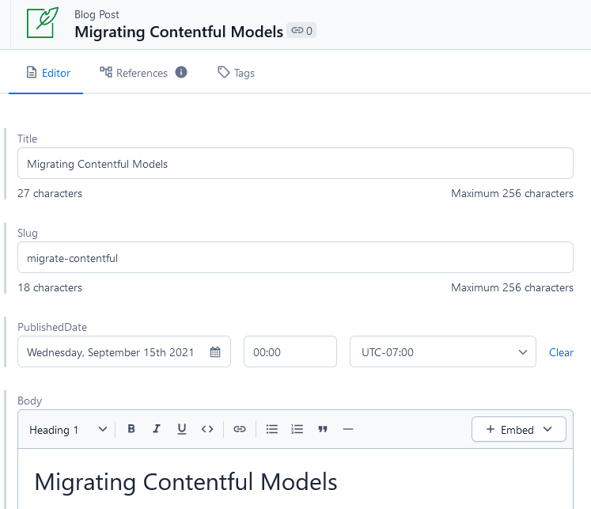
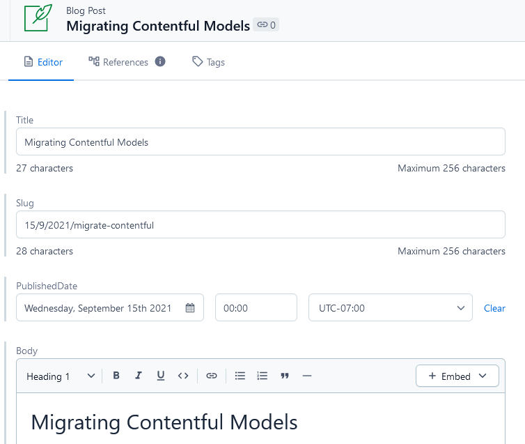

<h1 align="center">
  Gastby-Contentful Code Demo
</h1>

Gatsby.js application built using ContentfulCMS as data source.

# Information

## Contentful Backend Code

    ROOT LEVEL
    ├── /migration-scripts
    └── /migrations

Two new directories can be found in the root directiory.  `/migration-scripts` contains two Contentful backend scripts and `/migrations` contains the JSON results of `minutesToRead.js` before and after adding the field and modifying the vaules in the GUI.

--

### minutesToRead.js

  This file contains a `blogPost` specific Contentful migration that adds an `Integer` field with validation, range, help text, and error messaging.

  As per the [contentful-cli](https://github.com/contentful/contentful-cli/tree/master/docs/space/migration), this script can be run using the following:

  The script should be passed the `--space-id` option with `SPACEID-FROM-GUI` coming from the Contentful space-id found on the GUI online.
  
  ```shell
  contentful space migration --space-id SPACEID-FROM-GUI ./migration-scripts/minutesToRead.js
  ```

--

### blogSlugTransformer.js

  This file contains a script to export, modify each entry `slug` to include date `d/m/y/slug`, and re-import the data to Contentful.

  The script has been added to `package.json` and can be called using `npm run transform` and two mandatory arguments, `dir=` and `spaceid=`.
  
  ```shell
  npm run transform dir=TEMP-DIR-NAME spaceid=SPACEID-FROM-GUI
  ```
  
  Similar to above `SPACEID-FROM-GUI` comes from the Contentful space-id found on the GUI online.

  `TEMP-DIR-NAME` is a root-level directory that will be created and contain two `.json` files after the script runs.
    
  - `shortslugs.json` contains the unmodified exported json generated by using the `contentful space export` command.

  - `datelongslugs.json` contains the modified json generated by the script.  This file is then used to import to Contentful using `contentful space import` command.

  --
#### Notes

  - It should be noted that this script converts `slug` to `day/month/year/slug` and **NOT** `blog/{slug}` to `blog/{day/month/year}/{slug}` as `/blog/` is prepended on to the generated slugs during the `createPage` process within `gatsby-node.js`

  - This script was written in vanilla `js` and `node.js` in an effort to reduce dependencies. If external packages such as `commander` or `inquirer` were used, a significantly cleaner script could be written.  Additionally, it is likely that a purely `shell` script could be used to avoid `JS` altogether with the CLI, but this is beyond my wheelhouse.

  - This script will trigger Contentful API's rate limiting.  It's likely that sequential `space export/import` commands require a significant delay.  While the script finishes successfully, a rate limit is triggered at the end and the `import` command back retires after ~15 seconds.

  - This script also lacks proper validations and error handling beyond the basics.  As such, this script should be handled with care.

  --

#### Expected Results

  ```json
  // Example entry before modification:
  {
  "metadata": {...},
  "sys": {...},
  "fields": {
    "title": {...},
    "slug": {
      "en-US": "contentful-blog-post"
    },
    "publishedDate": {
      "en-US": "2021-08-28T00:00-07:00"
    },
    "body": {...}
    },
    "minutesToRead": {...}
  }
  ```
  ```json
  // Example entry after slug modification:
  {
  "metadata": {...},
  "sys": {...},
  "fields": {
    "title": {...},
    "slug": {
      "en-US": "28/8/2021/contentful-blog-post"
    },
    "publishedDate": {
      "en-US": "2021-08-28T00:00-07:00"
    },
    "body": {...}
    },
    "minutesToRead": {...}
  }
  ```

--

#### Validated Results

`Short Slugs:`



`Long Slugs with D/M/Y`



----

**Below contains previous FE setup/work.**

----
## Deviations from Tutorial

  A basic `Jest` testing workflow has been implemented and setup.  Testing can be triggered using:

  ```shell
  npm run test
  ```

  --

  Github Actions have been implemented using a `nodejs.yml` configuration file.  This enables a actions to run the Jest testing and trigger a Netlify build/deploy webhook on completion of successful tests.`  

  --

  Due to significant issues with `@contentful/rich-text-react-render` and `embedded-asset-blocks`,   `gatsby-source-contentful/rich-text` is used to render rich text in `templates > blog.js`.

  Unresolved breaking changes were introduced with the depreciation of `body { json }` to `body { raw }` in the GraphQL queries for Contentful.

  Related Issues: [#119](https://github.com/contentful/rich-text/issues/119), [#28098](https://github.com/gatsbyjs/gatsby/discussions/28098), [#61](https://github.com/contentful/rich-text/issues/61), [#10592](https://github.com/gatsbyjs/gatsby/issues/10592), [#176](https://github.com/contentful/rich-text/issues/176)

--

## Deployment

  [Netlify - Main](https://gatsby-contentful-demo-main.netlify.app/)

  Project hosted on Netlify. 
  
  Utilizes Netlify's webhooks to trigger rebuilds on new published content from the `ContentfulCMS` space.

  --
  
# Project Overview

1. **Created With:**

    Project based on Andrew Mead's Great Gastby Tutorial: [Youtube](https://www.youtube.com/watch?v=8t0vNu2fCCM).

    Project bootstrapped using [Gatsby-CLI](https://www.gatsbyjs.com/docs/tutorial/part-0/#gatsby-cli) and Gatsby's [hello-world](https://github.com/gatsbyjs/gatsby-starter-hello-world) starter template.

2. **Development**

    To install and develop this project:

    ```shell
    git clone https://github.com/ccbass/gatsby-contentful.git
    cd gatsby-contentful
    npm install
    ```
  
    Rename `.env.example` to `.env.development` in the root directory, and insert required ContentfulCMS `spaceid` and `access token`.

    ```shell
    npm run develop
    ```

    In order to utilize Github actions, a repository environment variable must be populated from Netlify:

    This webhook ID should be acquired from the Netlify site under `Build & Deploy > Build Hooks`.
  
    Only the last characters from the URL are required. `https://api.netlify.com/build_hooks/***************`

    ```shell
    NETLIFY_WEBHOOK
    ```

    Happy developing!

## Structure

    .
    ├── src
    │ ├── components
    │ │ └── component
    │ │   ├── component.js
    │ │   ├── component.module.scss
    │ │   └── component.test.js   
    │ ├── pages
    │ │ └── [Gatsby Page views]    
    │ ├── styles
    │ │ └── [Global stylesheets]    
    │ └── templates
    │   └── [React individual components]    
    │
    └── [Other configuration files, etc.]

1. **`/components`**: This directory contains folders of individual React components used to build each page, layout, etc.  Each folder should contain all relevant files to each component.  
1. **`/pages`**: This directory contains all of the top level permanent page views.
1. **`/styles`**: This directory contains global stylesheets not connected to specific views/components.
1. **`/templates`**: This directory contains generated page views based on imported content from external sources.
